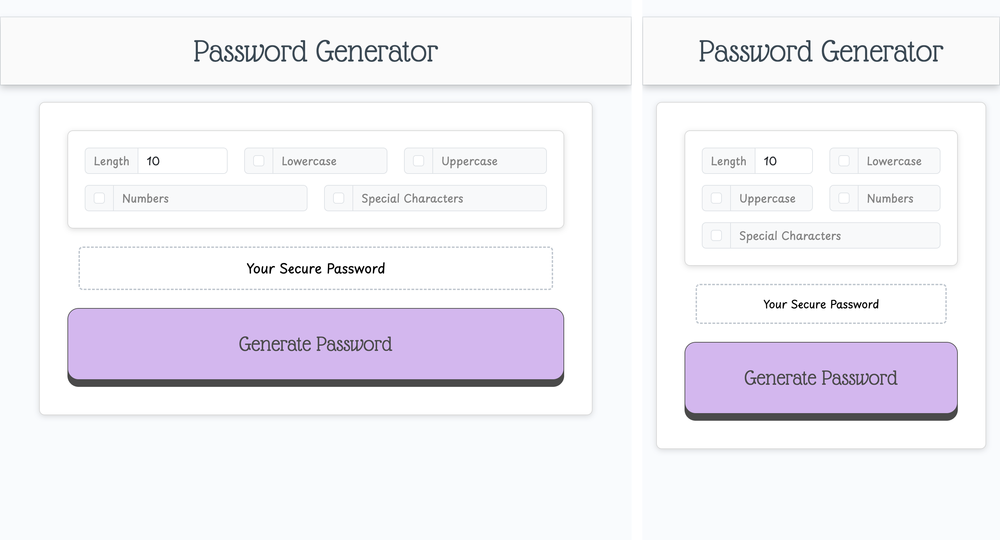

# random-password-generator-bc

## Website

https://mattlusty.github.io/random-password-generator-bc

## Description

Bootcamp (bc) - Module 5 Challenge.

Random Password Generator web app:

User can choose their options of length, and character types to generate their random password

## Features

1. Bootstrap styled form inputs to receive user password options
2. 3D effect button press effect using CSS
3. The generate password JS logic ensures every selected character type is used equally
4. Returns error messages if no user input provided

## Notes

I decided to use a carefully crafted user input form, leveraging bootstrap, instead of the simpler prompt method, for better user experience and also to provide myself more of a challenge. (Hope thats okay :)
